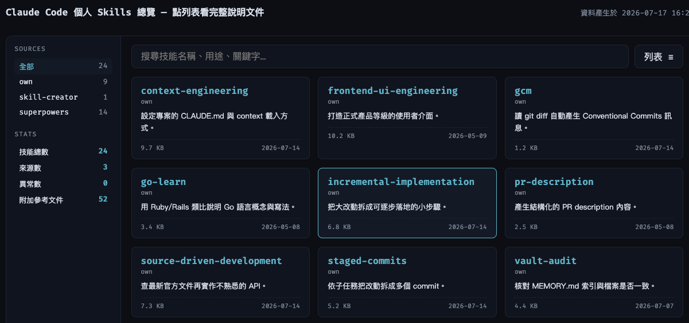

# Skills Dashboard

本地網頁 dashboard，可視化瀏覽 Claude Code 的所有 skills（自建＋plugin）。
唯讀——只負責「看」，建立與修改 skill 仍回 Claude Code 對話裡做。



## 功能

- 檔案總管式總覽：左側來源樹＋統計，右側列表 ⇄ 卡片雙視圖（localStorage 記憶偏好）
- client-side 即時搜尋（中英文、`/` 快捷鍵）＋來源過濾，AND 疊加
- 點列／卡片開 modal 渲染完整 SKILL.md，可跳獨立詳情頁 `/skills/:source/:name`
- 中文用途說明：sidecar `data/zh.yml`，不動 plugin 原檔，無譯文 fallback 英文
- plugin skill 顯示原始碼連結（`plugin.json` 優先，缺了 fallback marketplace metadata）

## 架構取捨

- **每次 request 現場讀檔案系統**：無 DB、無 cache——skill 有變動重整頁面即生效，
  代價是每次載入全量掃描（個人規模約 24 個 skills，可忽略）
- **plugin 多版本並存取最新**（`Gem::Version` 排序，非 semver 視為最舊）
- **一律降級不 crash**：frontmatter／plugin.json／marketplace.json／zh.yml 任何
  解析失敗，該項標異常或留空，頁面照常渲染

## 啟動

需求：Ruby 3.4.7（rbenv，`.ruby-version` 已釘版）。

```bash
bundle install
bin/dashboard        # → http://127.0.0.1:4567
```

預設掃描 `~/.claude/skills` 與 `~/.claude/plugins/cache`；路徑可用環境變數覆寫
（`SKILLS_DIR`／`PLUGINS_DIR`／`MARKETPLACES_DIR`／`ZH_FILE`）。
改到 `app.rb`／`lib/` 需重啟 server（不熱 reload）。

## 開發

```bash
bin/check                  # rubocop + bundler-audit + rspec
bundle exec rspec          # 只跑測試
```

新 skill 的中文說明：`data/zh.yml` 對應 source 底下加 `skill名: 一句中文用途。`。

設計文件與 roadmap：`docs/specs/2026-07-16-skills-dashboard-design.md`
